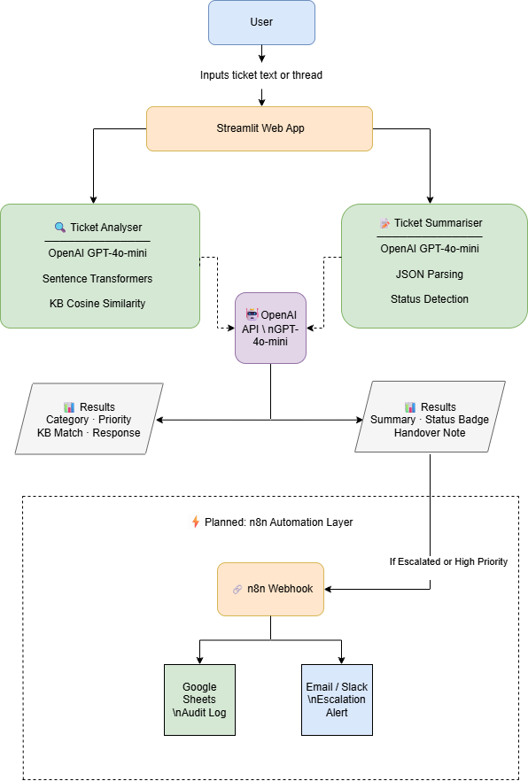

# 🤖 AI-Powered Service Desk Assistant

> **Status: 🚧 Active Development - Phase 6 Complete**

An AI-powered service desk tool built by a 9-year service operations veteran
to solve real problems I experienced firsthand managing 24/7 support teams.

---

## 🎯 The Problem This Solves

In high-volume service desk environments, engineers waste significant time on:
- Manually classifying and routing incoming tickets
- Writing repetitive first-response messages
- Searching through knowledge base articles during triage
- Summarizing long ticket threads during shift handovers

This tool automates those tasks using AI - freeing engineers to focus
on actual problem-solving.

---

## ✨ Planned Features

| Feature | Description | Status |
|---------|-------------|--------|
| 🎫 Ticket Classifier | Classify ticket type and priority | ✅ Complete |
| 💬 Response Generator | SLA-aware professional reply draft | ✅ Complete |
| 📚 KB Recommender | Match ticket to KB articles | ✅ Complete |
| 🖥 Web Demo (Streamlit) | Interactive UI to demo all features | ✅ Complete |
| 📝 Ticket Summarizer | Summarize long threads into 3-line handover notes | ✅ Complete |
| 🚨 Ticket Triage & Escalation | n8n webhook routing + Gmail alert for high severity | ✅ Complete |
| 🔍 KB Suggestion Before Escalation | Suggest KB resolution before escalating | 🔄 In Progress |
| 📊 Ticket History Log | Log and display all submitted tickets | ⏳ Planned |
| 📈 Ops Dashboard | Visual metrics — severity counts, categories | ⏳ Planned |

---

## 🏗 Architecture

**Tab 1 — Ticket Analyser**
- User submits a ticket via Streamlit UI
- OpenAI GPT-4o-mini classifies category, priority, and generates a response
- Sentence Transformers match the ticket to the most relevant KB article via cosine similarity

**Tab 2 — Ticket Summariser**
- User pastes a full ticket thread
- OpenAI GPT-4o-mini generates a 3-bullet summary, status, and handover note

**Tab 3 — Ticket Triage & Escalation**
- User submits a ticket with category and severity via Streamlit UI
- Ticket is sent via POST request to an n8n Cloud webhook
- n8n IF node checks severity — routes HIGH to Gmail escalation alert
- Low/normal severity tickets receive a standard confirmation response
- Gmail node sends an instant email alert for high priority incidents

---

## ⚠️ Limitations / Future Improvements

- Demo version uses manual text input only
- No authentication or role-based access yet
- Results depend on prompt quality and LLM output consistency
- Live demo uses API-backed requests, so token usage should be controlled
- n8n workflow requires production URL activation for persistent demo

---

## ⚡Future Automation

- Google Sheets logging for ticket history (Phase 8 option)
- Slack notification channel (alternative to Gmail)
- Confidence scoring or evaluation logging

---

## 🛠 Tech Stack

- **Python 3.11+**
- **OpenAI API** (GPT-4o) - classification and generation
- **Streamlit** - demo web interface
- **GitHub** - version control and portfolio
- **Sentence Transformers** (all-MiniLM-L6-v2)
- **n8n Cloud** - workflow automation and escalation routing

---

## 💡 Why I Built This

After 9 years running service desk operations hiring 20+ engineers,
managing 24/7 shifts, designing SLA frameworks - I saw firsthand how much
repetitive cognitive work could be automated without losing the human
judgment that actually matters.

This project is my practical exploration of that intersection:
**service operations expertise + AI tooling**.

## 🚀 Live Demo
[Try the app here](https://darjan86-ai-service-desk-assistant.streamlit.app/)

## How to Run Locally
1. Clone the repo
2. Install dependencies: `pip install -r requirements.txt`
3. Create a `.env` file: `OPENAI_API_KEY=sk-your-key`
4. Run: `python -m streamlit run app.py`

## 📸 Screenshots

### Interface

### Analysis Results

### Ticket Summarizer Results

---

## 👤 About the Author

**Darjan Stojanovski** - Service Operations Manager with 9+ years in SaaS support operations.
ITIL4 Foundation | AWS Cloud Practitioner | Open to remote roles.

🔗 [LinkedIn](linkedin.com/in/darjan-stojanovski-ab527812a)
