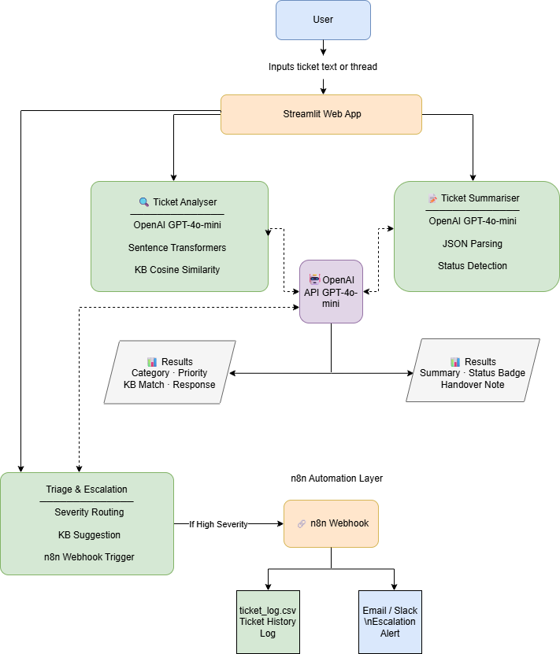

# 🎫 AI Service Desk Assistant

> **Status: 🚀 Live — Phase 10 Complete (v1.0)**

An AI-powered service desk assistant built with Python and Streamlit that classifies support tickets, generates professional responses, summarises ticket threads, routes tickets via automation workflows, and provides operational metrics — all in a single interactive web app.

[](https://darjan86-ai-service-desk-assistant.streamlit.app/)
[](https://github.com/darjan86/ai-service-desk-assistant)
[](https://python.org)

---

## 🌐 Live Demo

👉 **[https://darjan86-ai-service-desk-assistant.streamlit.app/](https://darjan86-ai-service-desk-assistant.streamlit.app/)**

> Demo app — do not paste sensitive or production data.

---

## 📋 Features

| Feature | Description | Status |
|---------|-------------|--------|
| 🔍 Ticket Classifier | Classify ticket type and priority using GPT-4o-mini | ✅ Complete |
| 💬 Response Generator | SLA-aware professional reply draft based on KB match | ✅ Complete |
| 📚 KB Recommender | Semantic search to match ticket to knowledge base articles | ✅ Complete |
| 🖥 Web Demo (Streamlit) | Interactive 5-tab UI to demo all features | ✅ Complete |
| 📝 Ticket Summarizer | Summarize long threads into 3-line shift handover notes | ✅ Complete |
| 🚨 Ticket Triage & Escalation | Severity routing via n8n webhook + Gmail alert for high severity | ✅ Complete |
| 📋 Ticket History Log | Log and display all submitted triage tickets in a live table | ✅ Complete |
| 📈 Ops Dashboard | Visual metrics — severity counts, category breakdown, volume over time | ✅ Complete |

---

## 🖥 App Tabs

### 🔍 Tab 1 — Ticket Analyser
Paste any IT support ticket and get instant AI classification including category, priority level (P1–P4), priority reasoning, a matched knowledge base article, and a fully drafted professional response.

### 📝 Tab 2 — Ticket Summarizer
Paste a full ticket thread and receive a structured 3-point issue summary, current status, status reason, and a ready-to-send shift handover note.

### 🚨 Tab 3 — Triage & Escalation
Submit a ticket for automated triage. The app classifies severity and category, suggests a relevant KB article, and routes the ticket via an n8n automation workflow. High severity tickets trigger a Gmail escalation alert automatically.

### 📋 Tab 4 — Ticket History Log
Every ticket submitted through the Triage tab is automatically logged to a CSV file and displayed here as a live table. Includes timestamp, title, severity, category, KB match, and escalation status. Includes a Clear Log button for demo purposes.

### 📈 Tab 5 — Ops Dashboard
Visual operations metrics powered by Plotly — KPI cards (total tickets, high severity count, escalations sent), tickets by severity bar chart, tickets by category pie chart, and ticket volume over time line chart.

---

## 🏗 Architecture



---

## ⚡ Tech Stack

| Tool | Purpose |
|------|---------|
| **Python 3.10+** | Core application language |
| **Streamlit** | Web UI framework and cloud deployment |
| **OpenAI GPT-4o-mini** | Ticket classification, response generation, summarization |
| **SentenceTransformers** | Semantic similarity search for KB matching |
| **scikit-learn** | Cosine similarity calculation |
| **n8n Cloud** | Workflow automation, severity routing and escalation |
| **Plotly** | Interactive charts for Ops Dashboard |
| **Pandas** | CSV log handling and data processing |

---

## 🚀 Run Locally

### 1. Clone the repository
```bash
git clone https://github.com/darjan86/ai-service-desk-assistant.git
cd ai-service-desk-assistant
```

### 2. Install dependencies
```bash
pip install -r requirements.txt
```

### 3. Set up secrets
Create a `.streamlit/secrets.toml` file:
```toml
OPENAI_API_KEY = "your-openai-api-key"
N8N_WEBHOOK_URL = "your-n8n-webhook-url"
```

### 4. Run the app
```bash
streamlit run app.py
```
---

## 📦 Requirements

streamlit
openai
sentence-transformers
scikit-learn
numpy
pandas
plotly
python-dotenv
requests

---

## 🚀 Live Demo
[Try the app here](https://darjan86-ai-service-desk-assistant.streamlit.app/)

## How to Run Locally
1. Clone the repo
2. Install dependencies: `pip install -r requirements.txt`
3. Create a `.env` file: `OPENAI_API_KEY=sk-your-key`
4. Run: `python -m streamlit run app.py`

## 📸 Screenshots

### Interface


---

## 👤 Author

**Darjan Stojanovski**
- GitHub: [@darjan86](https://github.com/darjan86)
- LinkedIn: [Darjan Stojanovski](https://www.linkedin.com/in/darjan-stojanovski/)

---

## 📄 License

This project is open source and available under the [MIT License](LICENSE).
